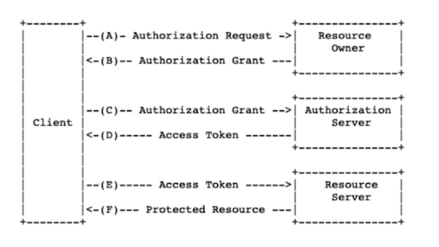
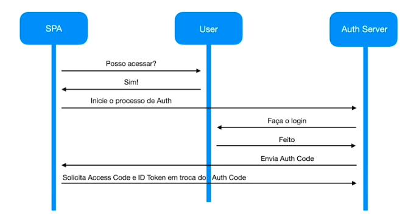

# Autenticação e Autorização em ambientes distribuídos.

## Exemplos 

### Conceito de OAuth
- Fulano - Dono de uma conta bancária 
- Mariana, esposa do Fulano
- Davi, gerente do banco 
- Cartório 

 

> Mariana chega no Davi, o gerente do banco, e pede para realizar em nome do Wesley uma transferência.

> Davi responde: Você não pode fazer isso. Somente o Wesley ou quem o Wesley autorizar através de uma procuração.

> Mariana vai até o cartório junto com o Wesley e fazem uma procuração para que a Mariana consiga realizar transferências bancárias no nome dele.

> Mariana chega no Davi, o gerente do banco, e pede para realizar em nome do Wesley uma transferência. E para isso ela apresenta a procuração.

> Davi pega a procuração, liga no cartório e verifica se a mesma realmente é válida

> Cartório confirma que a procuração é válida

> Davi fala para Mariana. A partir de agora, você poderá realizar transações em nome do Wesley.

Fulano - Dono de uma conta bancária => Resource Owner
Mariana, esposa do Wesley => Client
Davi, gerente do banco => Resource Server
Cartório => Authorization Server

Elementos de um processo de `autorização`

- Resource Owner = Dono do recurso
- Client = 
- Resource Server = 
- Authorization Server = 

### <em>O Oauth2 é um framework de autorização que permite terceiros consigam alcançar um acesso limitado de um serviço http</em>

> OAUTH2 nao é um Framework de Autenticação e sim de autorização

### Fluxo de autorização do OAUTH2

 
    

### OpenID Connect Flow

