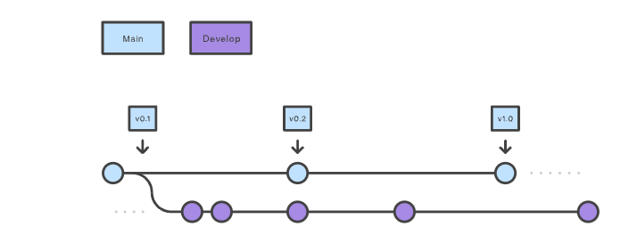
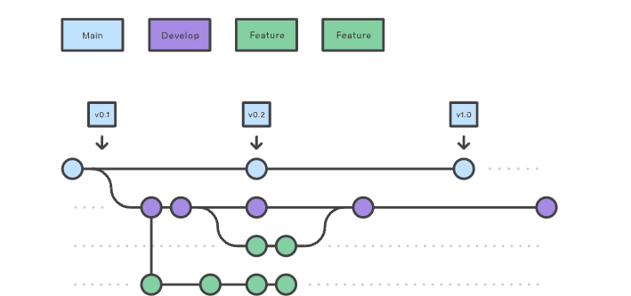
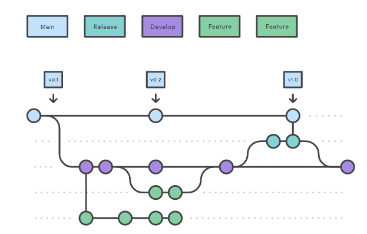
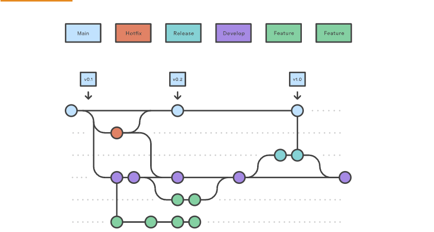

* Git Flow
* Configurações dos nossos branches
* Pull Requests / Templates para PR
* Code Review
* Plugin do VSCode
* CODEOWNERS
* SemVer


## O que é Gitflow? 

<p> 
Gitflow é um modelo alternativo de `ramificação`` do Git que envolve o uso de ramificações de recursos e múltiplas ramificações primárias. Foi publicado e popularizado pela primeira vez por Vincent Driessen na nvie. Comparado ao desenvolvimento baseado em tronco, o Gitflow possui inúmeras ramificações de vida mais longa e commits maiores. Nesse modelo, os desenvolvedores criam uma ramificação de recurso e atrasam a fusão dela com a ramificação de tronco principal até que o recurso seja concluído. Essas ramificações de recursos de longa duração exigem mais colaboração para serem mescladas e apresentam um risco maior de se desviarem da ramificação tronco. Eles também podem introduzir atualizações conflitantes.
</p>

<p>O Gitflow pode ser usado para projetos que têm um ciclo de lançamento programado e para as práticas recomendadas de DevOps de entrega contínua. Este fluxo de trabalho não adiciona novos conceitos ou comandos além do necessário para o fluxo de trabalho de ramificação de recursos. Em vez disso, atribui funções muito específicas a diferentes ramos e define como e quando eles devem interagir. Além dos feature ramos, ele utiliza ramos individuais para preparar, manter e gravar lançamentos. Claro, você também aproveita todos os benefícios do fluxo de trabalho do Feature Branch: pull requests, experimentos isolados e colaboração mais eficiente. </p>

## Como Funciona? 



Em vez de uma única branch ***main***, esse fluxo de trabalho usa duas ramificações para registrar o histórico do projeto. A ramificação main armazena o histórico de lançamento oficial, e a branch  ***develop*** serve como uma branch de integração de recursos. Também é conveniente marcar todos os commits na branch main  com um número de versão.


A primeira etapa é complementar o padrão main com uma ramificação develop. Uma maneira simples de fazer isso é um desenvolvedor criar uma ramificação develop vazia localmente e enviá-la ao servidor:

```shell
git branch develop
git push -u origin develop
```

Esta ramificação conterá o histórico completo do projeto, enquanto main conterá uma versão resumida. Outros desenvolvedores agora devem clonar o repositório central e criar um branch de rastreamento para develop.

> Ao usar a biblioteca de extensão git-flow, executar em um repositório existente criará a ramificação :git flow initdevelop

```shell 
git flow init


Initialized empty Git repository in ~/project/.git/
No branches exist yet. Base branches must be created now.
Branch name for production releases: [main]
Branch name for "next release" development: [develop]


How to name your supporting branch prefixes?
Feature branches? [feature/]
Release branches? [release/]
Hotfix branches? [hotfix/]
Support branches? [support/]
Version tag prefix? []


$ git branch
* develop
 main
```

## Feature branches

### Passo I - Criar o Repositório 

Cada novo recurso deve residir em seu próprio branch, que pode ser enviado para o repositório central para backup/colaboração. Mas, em vez de ramificar main, feature ramificações usam develop como ramificação pai. Quando um recurso é concluído, ele é mesclado novamente no desenvolvimento. Os recursos nunca devem interagir diretamente com main.



> Observe que feature as ramificações combinadas com a develop ramificação são, para todos os efeitos, o fluxo de trabalho da ramificação do recurso. Mas o fluxo de trabalho do Gitflow não para por aí. Feature ramificações geralmente são criadas a partir da ramificação develop mais recente.

### Criando uma ramificação de recurso

`Sem as extensões git-flow:`

```shell
git checkout develop
git checkout -b feature_branch
```

`com a extensão git-flow`
```shell 
git flow feature start feature_branch
```

> Continue seu trabalho e use o Git como faria normalmente.

### Concluindo uma ramificação de recursos

Quando terminar o trabalho de desenvolvimento do recurso, a próxima etapa é mesclar feature_branch em develop.

`Sem as extensões git-flow:`

```shell
git checkout develop
git merge feature_branch
```

`com a extensão git-flow`

```shell
git flow feature finish feature_branch
```

## Release branches




Depois que a branch `develop` tiver adquirido recursos suficientes para um release (ou uma data de lançamento predeterminada estiver se aproximando), você bifurcará uma branch release de develop, que pode ter progredido desde o início do lançamento e marcado com um número de versão. Além disso, ele deve ser mesclado novamente em será mesclado em develop. A criação deste branch inicia o próximo ciclo de lançamento, portanto nenhum novo recurso pode ser adicionado após este ponto - apenas correções de bugs, geração de documentação e outras tarefas orientadas ao lançamento devem ser incluídas neste branch. 

Usar um branch dedicado para preparar lançamentos possibilita que uma equipe aprimore a versão atual enquanto outra equipe continua trabalhando nos recursos para a próxima versão. Ele também cria fases de desenvolvimento bem definidas (por exemplo, é fácil dizer: “Esta semana estamos nos preparando para a versão 4.0” e realmente vê-lo na estrutura do repositório).

Fazer release ramificações é outra operação simples de ramificação. Assim como feature ramificações, release ramificações são baseadas na ramificação develop. Uma nova ramificação release pode ser criada usando os seguintes métodos.


`Sem as extensões git-flow:`

```shell
git checkout develop
git checkout -b release/0.1.0
```


`com a extensão git-flow`

```shell
$ git flow release start 0.1.0
Switched to a new branch 'release/0.1.0'
```

> Quando a versão estiver pronta para envio, ela será mesclada em main e develop e, em seguida, em release filial será excluída. É importante fazer o merge novamente em develop porque atualizações críticas podem ter sido adicionadas à ramificação release e elas precisam estar acessíveis para novos recursos. Se sua organização enfatiza a revisão de código, este seria o local ideal para uma solicitação pull.

Para finalizar uma ramificação release, use os seguintes métodos:

`Sem as extensões git-flow:`

```shell
git checkout main
git merge release/0.1.0
```

`com a extensão git-flow`

```shell 
git flow release finish '0.1.0'
```

## Hotfix branches



Manutenção ou “hotfix” ramificações são usadas para corrigir rapidamente versões de produção. Hotfix ramificações são muito parecidas com release ramificações e feature ramificações, exceto que são baseadas em main em vez de develop. Este é o único branch que deve bifurcar-se diretamente de main. Assim que a correção for concluída, ela deverá ser mesclada em main e develop (ou na ramificação release atual) e main deve ser marcado com um número de versão atualizado.

Ter uma linha de desenvolvimento dedicada para correção de bugs permite que sua equipe resolva problemas sem interromper o restante do fluxo de trabalho ou aguardar o próximo ciclo de lançamento. Você pode pensar nas ramificações de manutenção como ramificações ad hoc release que trabalham diretamente com main. Uma ramificação hotfix pode ser criada usando os seguintes métodos:

`Sem as extensões git-flow:`

```shell 
git checkout main
git checkout -b hotfix_branch

```

`com a extensão git-flow`

```shell
$ git flow hotfix start hotfix_branch
```

> Semelhante a finalizar uma branch release, uma branch hotfix é mesclada em main e develop.

`Sem as extensões git-flow:`

```shell
git checkout main
git merge hotfix_branch
git checkout develop
git merge hotfix_branch
git branch -D hotfix_branch

```

`com a extensão git-flow`

```shell
$ git flow hotfix finish hotfix_branch
```