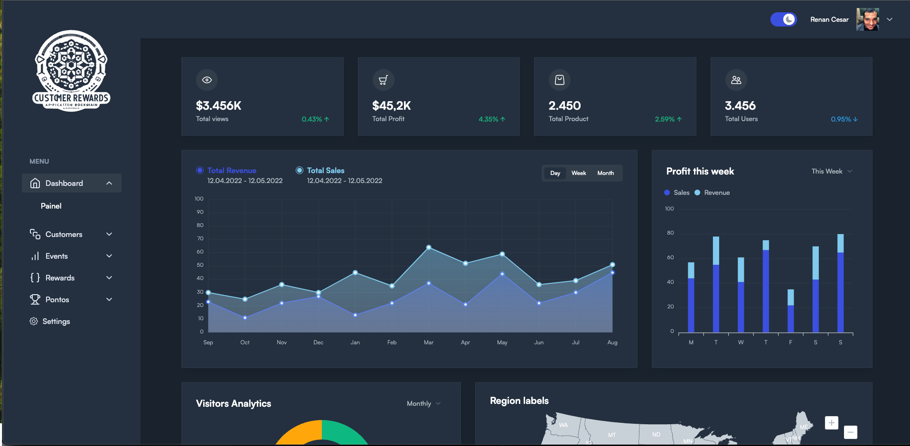

## Customer Rewards Admin UI 



## Visão Geral

Esse repositório é o painel de administração do protocolo de recompensas baseado em tokenização, todos fluxos e infraestrutura está conectado com o ecosistema do projeto geral.

<p> O projeto possui um sistema de authenticação usando o keycloak, configurando o banco de dados próprio para armazenamento de dados, `O Keycloak é uma solução de gerenciamento de identidade e acesso de código aberto, que oferece funcionalidades para autenticação e autorização de usuários em aplicações modernas e serviços` é seguro e robusto para atender diversos aplicações que precisam se conectar no mesmo ecossistema.</p>

> Para criar um ambiente de desenvolvimento com o keycloak e utilizar esse aplicativo basta executar os passos abaixo: 

1) Crie um docker-compose.yml abaixo: 

```docker-compose.yml
version: "3.4"

services: 
  keycloak:
    image: quay.io/keycloak/keycloak:21.1
    container_name: keycloak
    command: start-dev
    ports:
      - 8080:8080
    environment:
      - KEYCLOAK_ADMIN=admin
      - KEYCLOAK_ADMIN_PASSWORD=admin
      - KC_DB=mysql
      - KC_DB_URL=jdbc:mysql://db_keycloak:3306/keycloak
      - KC_DB_USERNAME=root
      - KC_DB_PASSWORD=root
    depends_on:
      db_keycloak:
        condition: service_healthy


  db_keycloak:
    image: mysql:8.2.0-oracle
    container_name: db_keycloak
    volumes:
      - ./.docker/dbdata:/var/lib/mysql
    environment:
      - MYSQL_ROOT_PASSWORD=root
      - MYSQL_DATABASE=keycloak
    security_opt:
      - seccomp:unconfined
    healthcheck:
      test: ["CMD", "mysqladmin" ,"ping", "-h", "localhost"]
      interval: 5s
      timeout: 10s
      retries: 3
```

### Entendendo o docker-compose.yml
<p> Primeiramente é feito o início do serviço do bando de dados mysql db_keycloak com algumas variaveis de ambientes já pré definidas para interagir. 
o serviço do db_keycloak possui um recurso do docker healtcheck para validar se o container foi iniciado sem erros e sem problemas para então o keycloak 
iniciar o serviço. Esse recurso é importante para não ocorrer erros e garantir que tudo ocorra tudo bem. </p>


## Projeto Front End 

<p> O Projeto é desenvolvido com o React usando o Vite para obter o melhor desempenho ao lado do servidor pois o vite já suporta os módulos nativos sem necessidade do babel ou outro transpilador javascript pro browser. Temos configurado no projeto o keycloak com a recuperação das informações do token JWT da sessão e login de usuário</p>

<p> O Painel de administrativo está sendo desenvolvido para obter todos dados em tempo real das interações com os contratos inteligente no node do besu (Ethereum Client), o usuário administrador poderá realizar as seguintes ações até a versão 1.0 do customer-rewards-admin-ui: </p>

| Ação        | Descrição                                                                                                                                |
| ----------- | ----------------------------------------------------------------------------------------------------------------------------------       |
| `Criar cliente`                      | Criar um cliente interagindo com smart contract e api do protocol                                               | 
| `Editar Cliente`                     | Editar um cliente já registrado na blockchain em conjunto na api do protocol                                    |
| `Visualizar informação dos clientes` | Visualizar informações do mapping do cliente diretamente pela api do protocol                                   | 
| `Adicionar Pontos`                   | Adiciona pontos ao cliente                                                                                      |
| `Remover Pontos`                     | Remove pontos do cliente                                                                                        | 
| `Visualizar Pontos`                  | Visualiza os pontos do cliente                                                                                  |
| `Visualizar Metadata`                | Visualiza a metadata que conterá todas informações de pontuação, insígnia, benefícios do cliente                |
| `ALterar Metadata`                   | Altera a metadata do protocol de administração de pontuação do cliente                                          |
| `Visualizar Insignias`               | Visualiza as insígnias do cliente, `CUSTOMER_PREMIUM` | `CUSTOMER_GOLD` | `CUSTOMER_TITANIUM`                   |
| `Alterar Insignias`                  | Alterar as informações das insígnia do protocol como nome, pontos para atingir etc...                           |
| `Visualizar Threshold`               | O Threshold é o limiar para chegar até um nível (insígnia), ele poderá visualizar o threshold atual.            |
| `Alterar Threshold`                  | Alterar o Threshold de um valor para outro valor ex: 200 para 400 para atingir CUSTOMER_GOLD                    |


## Desenvolvimento

### 📌 Pendências
- [ ] Implementar Elastick Search para monitoramento de eventos 
- [ ] Implementar Grafana para visualização de logs em tempo real da infraestrutura


### 🚀 Em Progresso
- 

### ✅ Concluídas
- [x] Configurar ambiente de desenvolvimento com dev container e docker 
- [x] Implementação do keycloak e authenticação.

