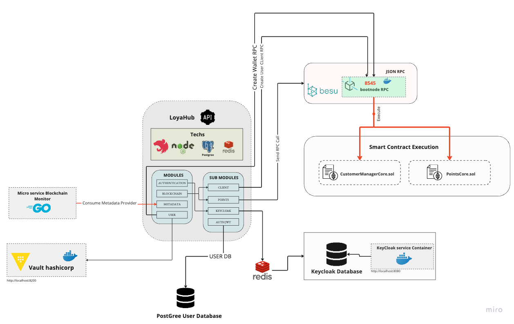

# Customer Rewards API

## Índice
- [Visão Geral](#visão-geral)
- [Arquitetura Hexagonal](#arquitetura-hexagonal)
  - [Principais Rotas](#principais-rotas)
    - [Clientes](#clientes)
    - [Pontos](#pontos)
    - [Metadata](#metadata)
- [Arquitetura dos Componentes](#arquitetura-dos-componentes)
- [Instalação e Configuração](#instalação-e-configuração)
- [Uso](#uso)
- [Contribuição](#contribuição)
- [Licença](#licença)
- [Desenvolvimento](#desenvolvimento)
  - [📌 Pendências](#-pendências)
  - [🚀 Em Progresso](#-em-progresso)
  - [✅ Concluídas](#-concluídas)

## Visão Geral

Este repositório contém o projeto back-end para o protocolo Loyahub em blockchain. O projeto foi desenvolvido com a arquitetura hexagonal, utilizando o conceito de ports e adapters para melhorar a legibilidade e manutenção do código.

## Arquitetura Hexagonal

<p align="center">
  
</p>

A estrutura de diretórios do projeto é organizada da seguinte maneira:

```plaintext
└── 📁loyahub-api
    └── 📁.vscode
        └── launch.json
        └── settings.json
    └── 📁src
        └── 📁config
            └── 📁Blockchain
                └── connection.ts
            └── 📁Database
                └── DatabaseConnection.ts
```

## Arquitetura dos Componentes

<p align="start">
  
</p>

### Principais Rotas

#### Clientes
- **POST** `/api/v1/client/new` → Cria um novo Cliente
- **GET** `/api/v1/client/data/{id}` → Traz informações do cliente
- **GET** `/api/v1/client/dataByName/{name}` → Traz informações do cliente pelo nome
- **GET** `/api/v1/client/dataByAge/{age}` → Traz informações do cliente pela idade
- **GET** `/api/v1/client/dataByWallet/{wallet}` → Traz informações do cliente pela wallet blockchain
- **GET** `/api/vl/client/currentId` → Traz o último ID de cliente gerado.

#### Pontos
- **POST** `/api/v1/points/add` → Adiciona pontos para um usuário pelo ID
- **GET** `/api/v1/points/{id}` → Recupera os pontos de um usuário pelo ID
- **PATCH** `/api/v1/points/remove` → Remove pontos de um usuário pelo ID
- **GET** `/api/v1/points/level/{id}` → Recupera o nível do usuário
- **GET** `/api/v1/points/nfts/all` → Recupera todos os NFTs que o usuário possui
- **GET** `/api/v1/points/nfts/simple` → Verifica se o usuário possui um NFT específico

#### Metadata
- **POST** `/api/v1/metadata/new` → Registra um novo Metadata
- **GET** `/api/v1/metadata/{tokenID}` → Recupera um Metadata registrado
- **PATCH** `/api/v1/metadata/{tokenID}` → Atualiza um Metadata registrado
- **DELETE** `/api/v1/metadata/{tokenID}` → Deleta um Metadata existente

#### Auth API Endpoint
- **POST** `/api/vl/auth/login` → Autentica o usuário

### AUTH Keycloak Endpoint
- **POST** `/api/v1/auth/keycloak/login` → Autentica o usuário pelo Keycloak
- **POST** `/api/v1/auth/keycloak/logout` → Desloga o usuário pelo Keycloak
- **POST** `/api/v1/auth/keycloak/refresh` → Gera um novo token de acesso

### USER API Endpoint
- **POST** `/api/v1/user/register` → Cria um novo usuário
- **PATCH** `/api/v1/user/update` → Atualiza um usuário existente
- **DELETE** `/api/v1/user/delete` → Deleta um usuário existente
- **GET** `/api/vl/user/get/{email}` → Traz informações do usuário

## Instalação e Configuração
Instruções detalhadas sobre como instalar e configurar o projeto.

## Uso
Guia de como usar a API, incluindo exemplos de requests e respostas.

## Contribuição
Diretrizes para contribuir para o projeto.

## Licença
Informações sobre a licença do projeto.

## Desenvolvimento

### 📌 Pendências
- [ ] Implementar ElasticSearch para monitoramento de eventos
- [ ] Implementar Grafana para visualização de logs em tempo real da infraestrutura

### 🚀 Em Progresso

### ✅ Concluídas
- [x] Implementar módulos de blockchain para customers
  - [x] Desenvolver rota POST para criar cliente
  - [x] Desenvolver rota PATCH para editar cliente
  - [x] Desenvolver rota POST para remover cliente
  - [x] Desenvolver rota GET para customers
  - [x] Desenvolver rota GET para customer por ID
  - [x] Desenvolver rota GET para customer por nome
  - [x] Desenvolver rota GET para customer por wallet
- [x] Implementar módulos de Metadata para NFTs
  - [x] Desenvolver rota POST para criar novo TokenID
  - [x] Desenvolver rota GET para trazer TokenID com sua metadata
  - [x] Desenvolver rota PATCH para editar metadata por TokenID
  - [x] Desenvolver rota DELETE para remover TokenID
- [x] Configurar ambiente de desenvolvimento com dev container e Docker
- [x] Implementação do Keycloak e autenticação.
- [x] Implementação das rotas de Points (add pontos e remover pontos) na admin UI
  - [x] Implementar rota API para trazer todos customers
  - [x] Implementar rota API para adicionar pontos
  - [x] Implementar rota API para remover pontos
