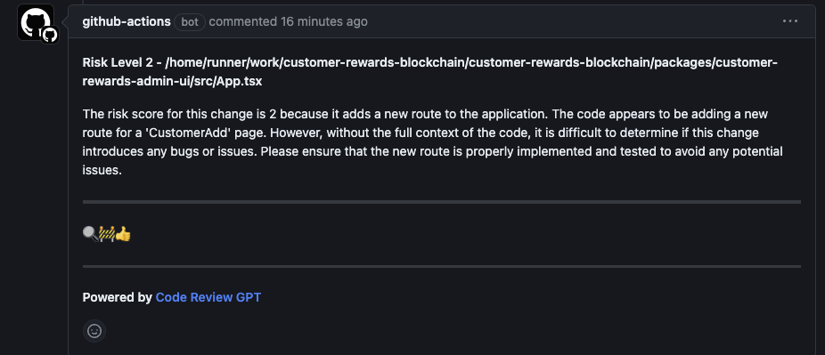
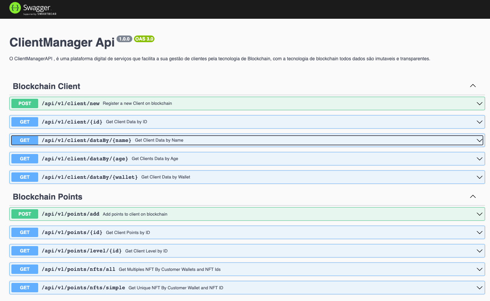
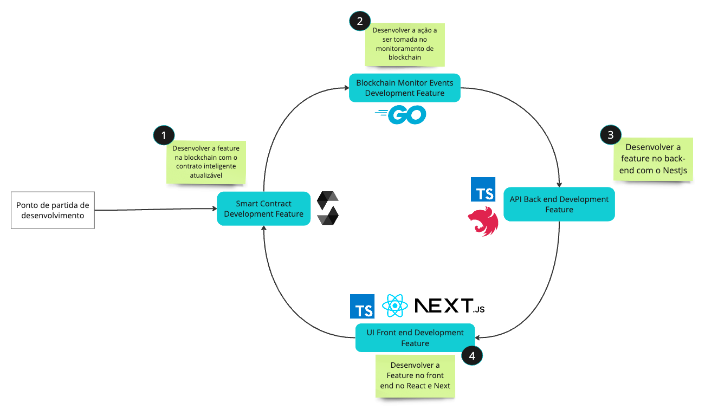

# Customer Rewards Blockchain

- [Customer Rewards Blockchain](#customer-rewards-blockchain)
  - [Visão Geral](#visão-geral)
  - [Auto Code Review GPT](#auto-code-review-gpt)
  - [Interação com a Blockchain](#interação-com-a-blockchain)
  - [Gerenciamento de Metadados de NFTs](#gerenciamento-de-metadados-de-nfts)
  - [API HTTP e Swagger](#api-http-e-swagger)
  - [Tecnologias](#tecnologias)
  - [Ciclo de nova Feature:](#ciclo-de-nova-feature)
  - [Estrutura de pastas](#estrutura-de-pastas)
- [Desenvolvimento](#desenvolvimento)
  - [📌 Pendências](#-pendências)
  - [🚀 Em Progresso](#-em-progresso)
  - [✅ Concluídas](#-concluídas)
  - [🧠 Ideias para Explorar](#-ideias-para-explorar)
  - [🛠️ Melhorias Futuras](#️-melhorias-futuras)
  - [📚 Documentação](#-documentação)


## Visão Geral

O projeto **Customer Rewards Application** é uma solução desenvolvida baseada em serviços  para otimizar a gestão de clientes com pontuação e emitir tokens de benefícios no ecossistema de blockchain privada. Utilizando **Hyperledger Besu** para gerenciar rede privada com o protocolo QBFT em conjunto com uma aplicação back-end equipada com os recursos das capacidades avançadas do [NestJS](https://nestjs.com/), um framework para aplicações server-side em Node.js, uma aplicação desenvolvida em golang separada apenas para interação com blockchain e escuta de eventos dos contratos inteligentes **(solidity)** diretamente no nó rpc do besu. Em desenvolvimento temos a dashboard ui do admin onde será feito a integração com apache Kafta, Grafana, Prometheus e Keycloak para authenticação. 

> Este projeto possui todos pacotes (packages) incorporados na arquitetura hexagonal com inversão de dependências, garantindo um design modular e de fácil manutenção.

## Auto Code Review GPT
<em> O projeto está equipado com uma infraestrutura para code review lançados pelo GPT-4 e GPT3 toda vez que um Pull Request é aberto, essa etapa foi desenvolvida para melhorar a qualidade do código e abertura de novas ideias durante o fechamento da PR, você pode ver mais em `infra/code-review-gpt` </em>




## Interação com a Blockchain

A essência do projeto reside na sua capacidade de interagir com a blockchain, permitindo o monitoramento e reação a eventos específicos da rede em tempo real. Isso é alcançado por meio de um micro-serviço dedicado, que escuta eventos na blockchain e executa ações correspondentes, como a atualização de registros de clientes, emissão de pontos para determinado cliente, emissão de tokens baseado em NFTs para representar uma `insignia` ou nível `level` em que um cliente se encontra dependendo do saldo de pontos que esse indivíduo possui.

## Gerenciamento de Metadados de NFTs

Uma característica central do sistema é o gerenciamento de metadados de NFTs, essencial para o registro, adição de pontos e atualização dos níveis dos clientes (`1` | `2` | `3`). Os NFTs são usados para representar diferentes níveis de clientes, como (`CUSTOMER_PREMIUM` | `CUSTOMER_GOLD` | `CUSTOMER_TITANIUM`), cada um com benefícios exclusivos. Os clientes acumulam pontos através de interações e compras, e esses pontos determinam o nível do NFT que lhes é atribuído. A mudança de níveis é refletida automaticamente pelo micro-serviço desenvolvido em go nos metadados do NFT correspondente, assegurando uma representação precisa do status do cliente.

> Aqui tem um exemplo de como é definidido as Metadata pelo tokenID de um usuario:

```json
{
  "tokenID": 2,
  "customer": "John Doe dos Santos",
  "description": "Você está no nível I com a insígnia Customer Premium",
  "image": "https://meusite.com/imagens/nft/1.png",
  "insight": "CUSTOMER_PREMIUM",
  "attributes": {
    "points": 240,
    "level": 1,
    "benefits": [
      {
        "level_type": "Nível",
        "value": 1
      },
      {
        "nft_type": "NFT",
        "value": "CUSTOMER_TITANIUM"
      },
      {
        "benefit_type": "Benefits",
        "value": [
          {
            "discount": "20%",
            "description": "Desconto de 20% em todos os produtos."
          },
          {
            "FreeFrete": "Frete GRATIS",
            "description": "Frete GRATIS no seu estado."
          },
          {
            "description": "Com esse benefício voce tem acesso ao nivel 1 do catalogo de promoção",
            "promotionLevel3": "Promoção nivel 1"
          }
        ]
      }
    ]
  },
  "databaseId": 8,
  "createdAt": "2023-11-23T16:43:47.683Z",
  "updatedAt": "2023-11-23T16:43:47.683Z"
}
```

## API HTTP e Swagger

O sistema também conta com uma API HTTP integrada para gerenciar os metadados dos NFTs. Isso inclui endpoints para consulta e atualização dos metadados baseados nos tokenIDs. A integração com o Swagger oferece uma documentação clara e interativa da API, facilitando o uso e a integração por parte dos desenvolvedores.

> Abaixo você pode ver uma breve ilustração:
> 

## Tecnologias

<div style="text-align: center;">
  
  
  
  
  
</div>

- NestJs
- Golang
- React
- Typescript
- Solidity
- PostgreeSQL
- TypeOrm
- EthereumGo

## Ciclo de nova Feature:

> O Planejamento para desenvolvimento de uma nova feature para esse projeto com um longo escopo está definida para seguir esse padrão abaixo:



1. Inicia se o desenvolvimento da feature na blockckchain com os contratos inteligentes que são atualizaveis com o  
   ERC1967Proxy.
1. Parte para o desenvolvimento da solução da feature na escuta dos eventos com o micro serviço desenvolvido em Go para gerenciamento de eventos e acionamentos de cronJobs.
1. Parte se para o desenvolvimento da solução da feature para o back-end, desenvolvendo-se os casos de uso, rotas, entidades e dominios para se atender.
1. Parte se para o desenvolvimento da solução no front end no React.

## Estrutura de pastas

> O projeto é um projeto monorepo baseado em projetos descentralizados de blockchain mas com enfase em blockchain privada.
> Temos esse domínios de pastas:

```log
monoRepo/
├─ docs/
├─ packages/
│    ├── blockchain-service
│    │   ├── package.json
│    ├── customer-rewards-api
│    │   ├── package.json
│    ├── customer-rewards-admin-ui
│    │   ├── package.json
│    ├── customer-rewards-ui
│    │   ├── package.json
│    ├── smart-contracts
│    │   ├── package.json
├── package.json
```

- O Projeto está sendo gerenciado pelo lerna, existem alguns scripts para serem executados na execução do projeto:

```file
monoRepo/
├─ docs/
├─ packages/
├── package.json
```

```json
 "scripts": {
    "start:dev": "lerna run --parallel --stream dev --scope customer-rewards-api --scope customer-rewards-ui --scope blockchain-service",
    "dev": "lerna run --parallel --stream dev --scope customer-rewards-api --scope customer-rewards-ui",
    "sc": "lerna run --scope smart-contracts compile",
    "bs": "lerna run --scope blockchain-service --stream dev",
    "api": "lerna run --scope customer-rewards-api --stream dev",
    "ui": "lerna run --scope customer-rewards-ui --stream dev",
    "clean": "lerna run clean",
    "build": "pnpm recursive run build",
    "test": "pnpm recursive run test"
  },
```

| Comando     | Descrição                                                                                                                          |
| ----------- | ---------------------------------------------------------------------------------------------------------------------------------- |
| `start:dev` | Executa paralelamente todos os aplicativos relacionados ao protocolo de gerenciamento de clientes (API, UI, e serviço blockchain). |
| `dev`       | Executa paralelamente a API e a UI do gerenciador de clientes.                                                                     |
| `sc`        | Executa o comando de compilação no projeto de smart contracts.                                                                     |
| `bs`        | Executa o micro serviço blockchain.                                                                                                |
| `api`       | Executa a API do gerenciador de clientes.                                                                                          |
| `ui`        | Executa a interface do usuário (UI) do gerenciador de clientes.                                                                    |
| `clean`     | Executa o comando de limpeza em todos os pacotes do monorepo.                                                                      |
| `build`     | Executa o comando de build em todos os pacotes do monorepo de forma recursiva.                                                     |
| `test`      | Executa testes em todos os pacotes do monorepo de forma recursiva.                                                                 |

# Desenvolvimento

## 📌 Pendências

- blockchain-service
  - [ ] Integrar banco de dados PostGree no Micro Serviço Go

- customer-rewards-admin-ui 
  - [ ] Implementar Elastick Search para monitoramento de eventos 
  - [ ] Implementar Grafana para visualização de logs em tempo real da infraestrutura

- customer-rewards-api
  - [ ] Implementar novas rotas para interagir com os contratos inteligentes 
  - [ ] Configurar e implementar WebSocket para eventos 
  - [ ] Configurar e implementar Prometheus para Kafta
  - [ ] Configurar e implementar Apache Kafta 
  - [ ] Confiturar e implementar Grafana 

- customer-rewards-ui


- smart-contracts
  - [ ] Definir lógica para remoção automática de 20% dos pontos após 30 dias.


## 🚀 Em Progresso
  - [ ] Desenvolver modelo de NFT visual para as insígnias 
  - [ ] Implementar Modelo Visual do NFT na Dashboard para leitura de metadados 


## ✅ Concluídas

- [x] Configurar ambiente de desenvolvimento inicial.
- [x] Subir ambiente blockchain com Hyperledger Besu e Firefly
- [x] Configurar monoRepo e scripts com o lerna
- [x] Revisar e validar estruturas existentes no contrato `CustomerManagementCore.sol`.
- [x] Estabelecer sistema de cadastro e gerenciamento de pontos dos clientes.
- [x] Desenvolver integração de pontuação com ERC1155.
- [x] Criar tokens NFT para insígnias (PremiumCustomer, GoldCustomer, TitaniumCustomer).
- [x] Tornar a porcentagem de remoção de pontos ajustável pelo administrador do contrato.
- [x] Implementar testes automatizados para novas funcionalidades.
- [x] Desenvolvimento de todos testes unitarios
- [x] Implementar Rotas no Back-end API
- [x] Integrar banco de dados PostGree no backEnd
- [x] Implementar API de Metadatas dos tokens ERC1155 das insignas
- [x] Implementar função para atualizar metadata do NFT conforme níveis de pontuação.
- [x] Implementar rotas para deletar e update metadata do NFT na api.
- [x] Implementar autenticação via keycloack e database para usuarios 
- [x] Configurar ambiente de desenvolvimento com dev container e docker 
- [x] Implementação das rotas de Points (add pontos e remover Pontos) na admin ui
    - [x] Implementar rota api para trazer todos customers 
    - [x] Implementar rota api para adicionar pontos 
    - [x] Implementar rota api para remover pontos 
    - [x] Implementar Página React para add pontos na Dashboard 
    - [x] Implementar Página React para remover pontos na Dashboard 

## 🧠 Ideias para Explorar
- [ ] Avaliar interoperabilidade com outros contratos inteligentes.

## 🛠️ Melhorias Futuras

- [ ] Otimizar funções para maior eficiência de gás.

## 📚 Documentação

- [ ] Atualizar documentação com detalhes das novas funcionalidades.
- [ ] Criar guia de uso para a interface de administração de pontos.
